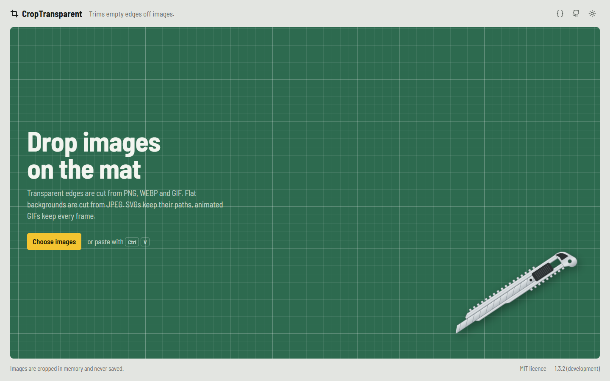
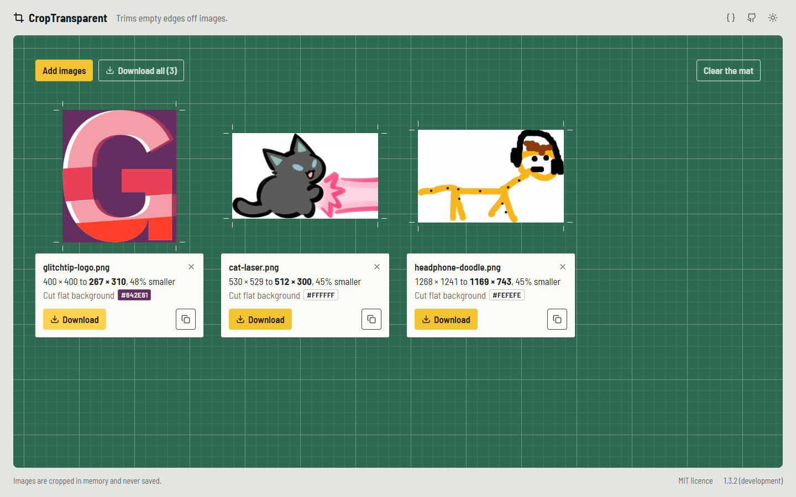
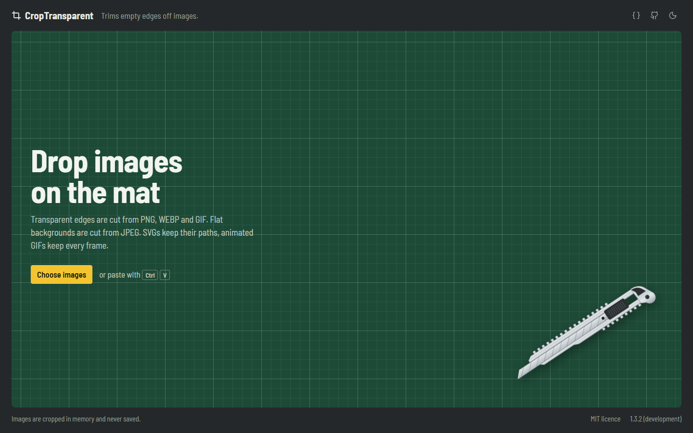
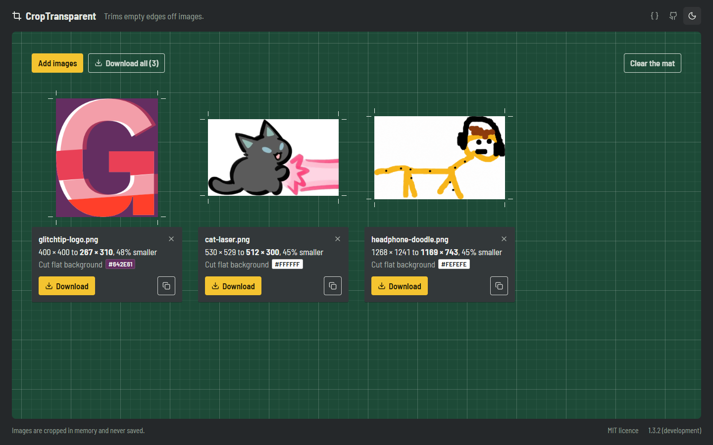
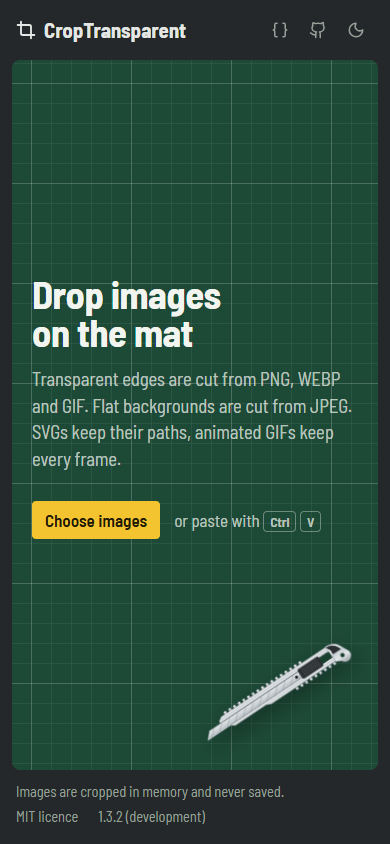

<p align="center">
  
</p>

<h1 align="center">CropTransparent</h1>

<p align="center">
  <strong>Trims the empty edges off your images: transparent borders, flat backgrounds, and empty SVG space.</strong>
</p>

<p align="center">
  <a href="https://github.com/PianoNic/CropTransparent"></a>
  <a href="https://github.com/PianoNic/CropTransparent/blob/main/LICENSE"></a>
  <a href="https://github.com/PianoNic/CropTransparent/releases"></a>
  <a href="docs/self-hosting.md"></a>
</p>

## Screenshots

<p align="center">
  
  
</p>
<p align="center">
  
  
</p>

<details>
<summary><strong>Mobile</strong></summary>

<p align="center">
  
</p>

</details>

## Features

- **Transparent edges**: PNG, GIF and WEBP are trimmed to the bounds of their alpha channel.
- **Flat backgrounds**: JPEGs and opaque images lose any uniform border detected from the corners, without leaving a compression fringe.
- **Animated images**: every frame of a GIF, WEBP or APNG is cropped to one shared box, so the animation stays intact.
- **SVGs stay vector**: the `viewBox` is tightened to the content, paths are untouched.
- **Batch friendly**: drop, browse or paste (<kbd>Ctrl</kbd>+<kbd>V</kbd>) several images at once, then download one or all as a ZIP.
- **Private**: images are processed in memory and never written to disk.

## Quick start

```bash
docker run -p 5000:5000 ghcr.io/pianonic/croptransparent:latest
```

Open <http://localhost:5000>.

## Documentation

- [Self-hosting](docs/self-hosting.md): Docker Compose, Docker and updating
- [Configuration](docs/configuration.md): environment variables and limits
- [API](docs/api.md): cropping images without the UI
- [Development](docs/development.md): running from source, tests and linting
- [Architecture](docs/architecture.md): how the code is organised
- [Releasing](docs/releasing.md): how versions and images are published

## License

[MIT](LICENSE)
